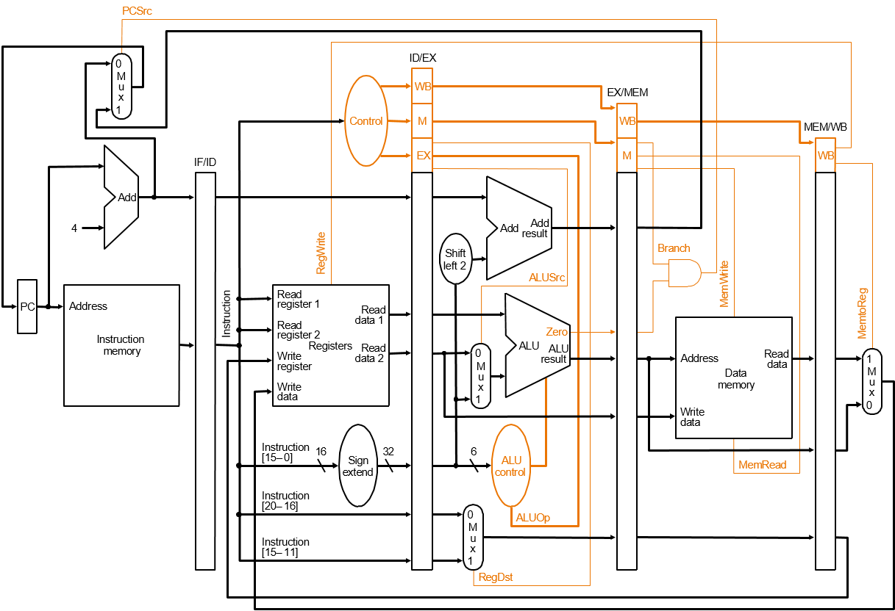
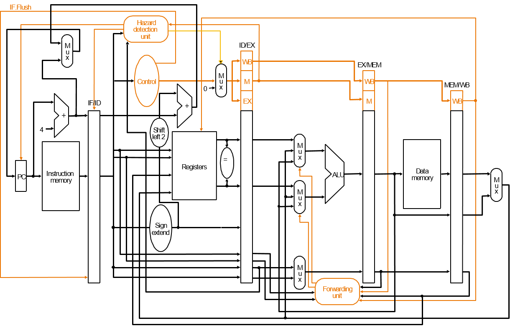

# Mips CPU

宋小牛 PB15000301

[TOC]

## 功能

* 支持的指令：
  * add addu addi addiu sub subu subi subiu
  * and andi or ori nor xor xori
  * bne bgtz j jr
  * lw sw
* 阻塞，转发，五级流水线
* 观察指定地址内存

## 设计

五级流水线CPU，每两级流水线之间之间添加流水寄存器，分别为IF_ID, ID_EX, EX_MEM, MEM_WB reg，并添加了Forwarding、Hazard模块。




(1)*Control Module*
**主要用于控制CPU各模块是否可写，操作数来源**

> RegWrite：寄存器是否可写 
> MemtoReg：是否由存储器向寄存器中写入
> MemWrite：存储器是否可写
> Branch：是否分支
> ALUOp:控制运算器对应的运算指令
> ALUSrc:选择运算器的第二个操作数
> RegDst:选择写入寄存器的寄存器号
> Jump:是否跳转
> JumpaddrSrc:跳转地址来源

```verilog
module control(
	input [5:0] Funct,
	input [5:0] Opcode,
	//input clk,
	//input rst_n,
	output reg RegDst,
	output reg Branch,
	output reg MemtoReg,
	output reg MemWrite,
	output reg ALUSrc,
	output reg [2:0] ALUOp,
	output reg RegWrite,
	//output reg [1:0] PCSrc,
	output reg Jump,
	output reg MemRead,
	output reg JumpaddrSrc
	);
	reg [3:0] current_state;
	reg [3:0] next_state;
	parameter rtype=6'b000000;
	parameter lw=6'b100011;
	parameter sw=6'b101011;
	parameter bgtz=6'b000111;
	parameter bne=6'b000101;
	parameter addi=6'b001000;
	parameter andi=6'b001100;
	parameter j=6'b000010;
	parameter addiu=6'b001001;
	parameter subi=6'b001010;
	parameter subiu=6'b001011;
	parameter ori=6'b001101;
	parameter xori=6'b001110;
	always @(*)
	begin
		case(Opcode)
			lw: begin
					//PCSrc=2'b00;
				
				RegDst=0;
				ALUOp=3'b000;	//add
				ALUSrc=1;
				Jump=0;
					JumpaddrSrc=0;
				
				Branch=0;
				MemWrite=0;
				
				RegWrite=1;
				MemtoReg=1;
				MemRead=1;
			end
			sw: begin
					//PCSrc=2'b00;
				
				RegDst=0;
					ALUOp=3'b000;	//add
				ALUSrc=1;
				Jump=0;
					JumpaddrSrc=0;
				
				Branch=0;
				MemWrite=1;
				
				RegWrite=0;
				MemtoReg=0;
				MemRead=0;
			end
			bne: begin
					//PCSrc=2'b00;
				
				RegDst=0;
					ALUOp=3'b001;	//bne,sub
				ALUSrc=0;
				Jump=0;
					JumpaddrSrc=0;
				
				Branch=1;
				MemWrite=0;
				
				RegWrite=0;
				MemtoReg=0;
				MemRead=0;
			end
			bgtz: begin
					//PCSrc=2'b00;
				
				RegDst=0;
					ALUOp=3'b100;	//bgtz
				ALUSrc=0;
				Jump=0;
					JumpaddrSrc=0;
				
				Branch=1;
				MemWrite=0;
				
				RegWrite=0;
				MemtoReg=0;
				MemRead=0;
			end
			rtype: begin
				if(Funct==8) begin	//jr
						//PCSrc=2'b00;
				
					RegDst=0;
						ALUOp=3'b000;	//add
					ALUSrc=0;
					Jump=1;
					JumpaddrSrc=1;
					Branch=0;
					MemWrite=0;
				
					RegWrite=0;
					MemtoReg=0;
					MemRead=0;
				end
				else if(Funct==6'b001100) begin	//syscall
						//PCSrc=2'b00;
				
					RegDst=0;
						ALUOp=3'b000;	//add
					ALUSrc=0;
					Jump=0;
					JumpaddrSrc=0;
					Branch=0;
					MemWrite=0;
				
					RegWrite=0;
					MemtoReg=0;
					MemRead=0;
				end
				else begin	//rtype
						//PCSrc=2'b00;
				
					RegDst=1;
						ALUOp=3'b010;	//funct
					ALUSrc=0;
					Jump=0;
					JumpaddrSrc=0;
				
					Branch=0;
					MemWrite=0;
				
					RegWrite=1;
					MemtoReg=0;
					MemRead=0;
				end
			end
			andi: begin
					//PCSrc=2'b00;
				
				RegDst=0;
					ALUOp=3'b011;	//imm
				ALUSrc=1;
				Jump=0;
				JumpaddrSrc=0;
				
				Branch=0;
				MemWrite=0;
			
				RegWrite=1;
				MemtoReg=0;
				MemRead=0;
			end
			addi: begin
					//PCSrc=2'b00;
				
				RegDst=0;
					ALUOp=3'b011;	//imm
				ALUSrc=1;
				Jump=0;
				JumpaddrSrc=0;
				
				Branch=0;
				MemWrite=0;
			
				RegWrite=1;
				MemtoReg=0;
				MemRead=0;
			end
			addiu: begin
				RegDst=0;
					ALUOp=3'b011;	//imm
				ALUSrc=1;
				Jump=0;
				JumpaddrSrc=0;
				
				Branch=0;
				MemWrite=0;
			
				RegWrite=1;
				MemtoReg=0;
				MemRead=0;
			end
			subi: begin
			
				RegDst=0;
					ALUOp=3'b011;	//imm
				ALUSrc=1;
				Jump=0;
				JumpaddrSrc=0;
				
				Branch=0;
				MemWrite=0;
			
				RegWrite=1;
				MemtoReg=0;
				MemRead=0;
			end
			subiu:begin
			
				RegDst=0;
					ALUOp=3'b011;	//imm
				ALUSrc=1;
				Jump=0;
				JumpaddrSrc=0;
				
				Branch=0;
				MemWrite=0;
			
				RegWrite=1;
				MemtoReg=0;
				MemRead=0;
			end
			ori: begin
			
				RegDst=0;
					ALUOp=3'b011;	//imm
				ALUSrc=1;
				Jump=0;
				JumpaddrSrc=0;
				
				Branch=0;
				MemWrite=0;
			
				RegWrite=1;
				MemtoReg=0;
				MemRead=0;
			end
			xori:begin
			
				RegDst=0;
					ALUOp=3'b011;	//imm
				ALUSrc=1;
				Jump=0;
				JumpaddrSrc=0;
				
				Branch=0;
				MemWrite=0;
			
				RegWrite=1;
				MemtoReg=0;
				MemRead=0;
			end
			j: begin
					//PCSrc=2'b00;
				
				RegDst=0;
					ALUOp=3'b011;	//imm
				ALUSrc=0;
				Jump=1;
				JumpaddrSrc=0;
				Branch=0;
				MemWrite=0;
			
				RegWrite=0;
				MemtoReg=0;
				MemRead=0;
			end
			default: begin
				
				RegDst=0;
					ALUOp=3'b000;	//imm
				ALUSrc=0;
				Jump=0;
				JumpaddrSrc=0;
				Branch=0;
				MemWrite=0;
			
				RegWrite=0;
				MemtoReg=0;
				MemRead=0;
			end
				//ALUOp=3'b010;		//funct
				//ALUOp=3'b001;		//bne,sub
				//wusuowei
				//ALUOp=3'b100;		//bgtz,
				//001000 addi,001100 andi
		endcase
	end
endmodule
```

(2)*Hazard Module*
**用于阻塞。取数指令需要考虑影响之后的alu指令运算数；分支指令，jr指令在运算数转发时需考虑阻塞**

> Hazard：是否发生阻塞，供top使用
> HazardPCSrc：阻塞后PC来源
> IRWrite：指令寄存器可写
> PCWrite：PC可写

```verilog
module Hazard(
	input ID_EX_MemRead,
	input [4:0] Rs,
	input [4:0] Rt,
	input [4:0] ID_EX_Rt,
	input [5:0] Opcode,
	input [5:0] Funct,
	output reg Hazard,
	output reg PCWrite,
	//output reg InsSrc,
	output reg IRWrite,
	output reg HazardPCSrc
    );
	always @(*) begin
		if(ID_EX_MemRead && ((Rs==ID_EX_Rt)||(Rt==ID_EX_Rt))||(Opcode==0 && Funct==6'b001100 && ID_EX_Rt==2)) begin
			Hazard=0;
			PCWrite=0;
			//InsSrc=1;
			IRWrite=0;
			HazardPCSrc=1;
		end
		else begin
			Hazard=1;
			PCWrite=1;
			//InsSrc=0;
			IRWrite=1;
			HazardPCSrc=0;
		end
	end

endmodule
```

(3)*Forward Module*
**用于实现数据转发** 

> ALUSrcA：ALU第一个操作数的来源
> ALUSrcB：ALU第二个操作数的来源

```verilog
module Forwarding(
	input [4:0] ID_EX_Rs,
	input [4:0] ID_EX_Rt,
	input [4:0] EX_M_RegDst,
	input [4:0] M_WB_RegDst,
	input EX_M_RegWrite,
	input M_WB_RegWrite,
	output reg [1:0] ALUSrcA,
	output reg [1:0] ALUSrcB
   );
	//if EX_M regwrite 1,check regdst
	always @(*) begin
		if(EX_M_RegWrite && (ID_EX_Rs==EX_M_RegDst)) 
			ALUSrcA=2'b10;
		else if(M_WB_RegWrite && (ID_EX_Rs==M_WB_RegDst)) 
			ALUSrcA=2'b01;
		else ALUSrcA=2'b00;
		
		if(EX_M_RegWrite && (ID_EX_Rt==EX_M_RegDst)) 
			ALUSrcB=2'b10;
		else if(M_WB_RegWrite && (ID_EX_Rt==M_WB_RegDst)) 
			ALUSrcB=2'b01;
		else ALUSrcB=2'b00;
	end


endmodule
```

## 使用

* 利用[MARS(一个mips模拟器)]((http://courses.missouristate.edu/KenVollmar/mars/) )将mips汇编代码翻译到16进制的机器码，并将代码段和数据段的机器码的起始地址都改为0

* 利用准备好的机器码作为初始化文件初始化*ise distributed memory generator*。

* 生成bit文件烧写到开发板上。

* 程序结束后即可观察内存利用开关作为内存地址输入，七段数码管即可显示对应数据的16进制表示。
## 总结

外设不多，没有IO指令的支持，没有中断，较粗糙。

## 源码

[Mips-CPU](https://github.com/Jeffery-Song/MIPS-CPU)